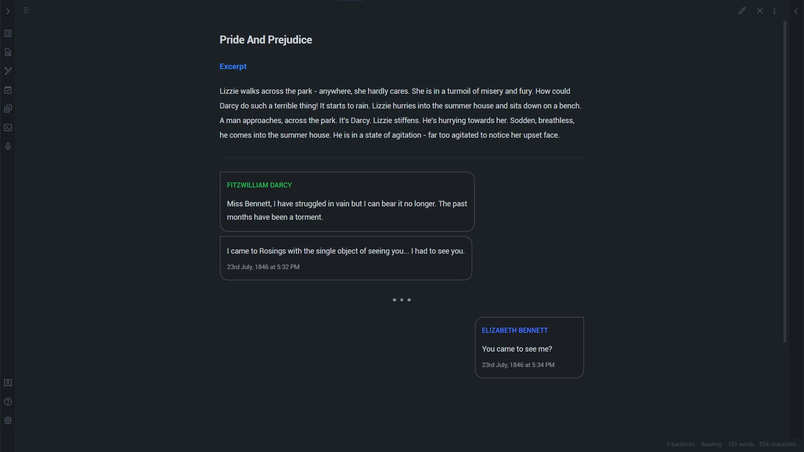
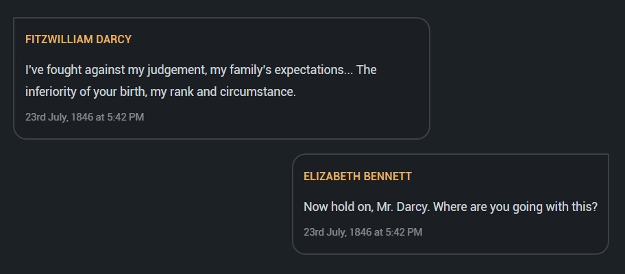
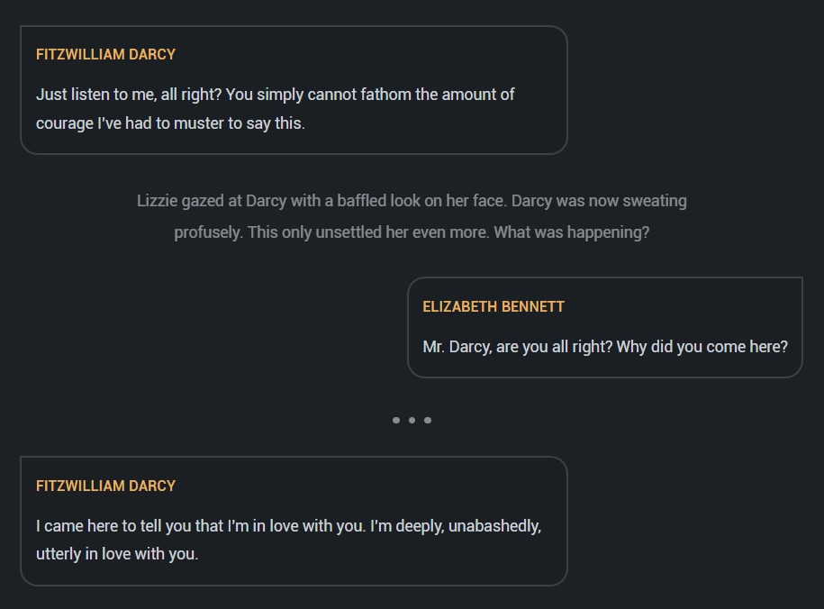
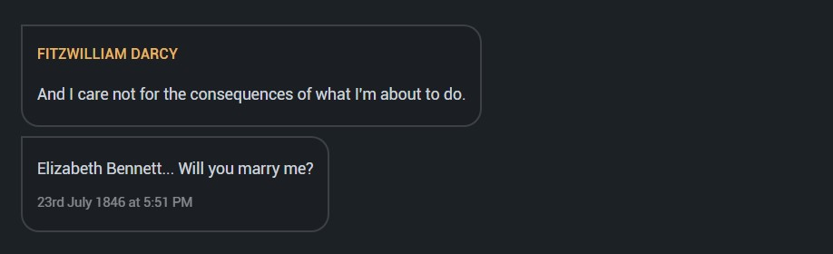
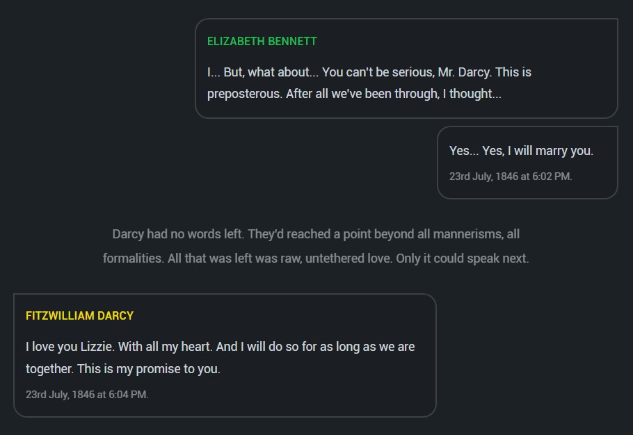

# Obsidian Chat View Plugin
Chat View let's you quickly and easily create elegant Chat UIs in your Markdown Files.



## Usage

Every chat message must be prefixed with a `'>'`, `'<'` or `'^'` for left, right & center aligning the messages respectively. Each chat message consists of 3 parts: The header, message and the subtext. The parts are separated by a `'|'` character. Take a look at the example below to see how it works:
~~~
```chat
> Fitzwilliam Darcy | I've fought against my judgement, my family's expectations... The inferiority of your birth, my rank and circumstance. | 23rd July, 1846 at 5:42 PM
< Elizabeth Bennett | Now hold on, Mr. Darcy, I'm afraid I don't understand where you're going with this. | 23rd July, 1846 at 5:42 PM
```
~~~
The above code will generate the following Chat View:



## Add Delimiters & Comments
You can add delimiters to your chat view simply by entering `'...'` on a line. To add a comment, start a line with the `'#'` character. Take a look at the following example:

~~~
```chat
> Fitzwilliam Darcy | Just listen to me, all right? You simply cannot fathom the amount of courage I've had to muster to say this.
# Lizzie gazed at Darcy with a baffled look on her face. He was now sweating profusely.
< Elizabeth Bennett | Mr. Darcy, are you all right? Why did you come here?
...
> Fitzwilliam Darcy | I came here to tell you that I'm in love with you. I'm deeply, unabashedly, utterly in love with you.
```
~~~

The above code will generate the following Chat View:



As you may have noticed, I've actually left out the subtext from these messages. The Chat View plugin is flexible that way. You can also leave out the header if you like just by starting the message off with the `'|'` character. For example, the following code:

~~~
```chat
> Fitzwilliam Darcy | And I care not for the consequences of what I'm about to do.
> | Elizabeth Bennett, will you marry me? | 23rd July 1846, 5:51 PM
```
~~~

Will result in the Chat View seen below:



## Colored Headers
To add that last bit of organization & pizazz, the plugin also includes the ability to color-code headers. You may choose from 7 colors to style your headers: `[red, green, yellow, blue, purple, orange, grey]`. How is this done? Simply add the following mapping anywhere in your code:

`[Person Name=color, Other Person Name=color]`. As is done in the code you see below:

~~~
```chat
[Elizabeth Bennett=green, Fitzwilliam Darcy=yellow]

< Elizabeth Swann | I... But what about... You can't be serious, Mr. Darcy. This is preposterous. After all we've been through, I thought...
< | Yes. I will marry you. | 23rd July, 1846 at 6:02 PM.
# Darcy had no words left. They'd reached a point beyond all mannerisms, all formalities. All that was left was raw love. Only it could speak next.
> Fitzwilliam Darcy | I love you Elizabeth. With all my heart. And I will do so for as long as we shall be together. | 23rd July, 1846 at 6:04 PM.
```
~~~

The above code will generate the following Chat View:




## Thank you for reading!

This project is associated with an [MIT License](LICENSE).