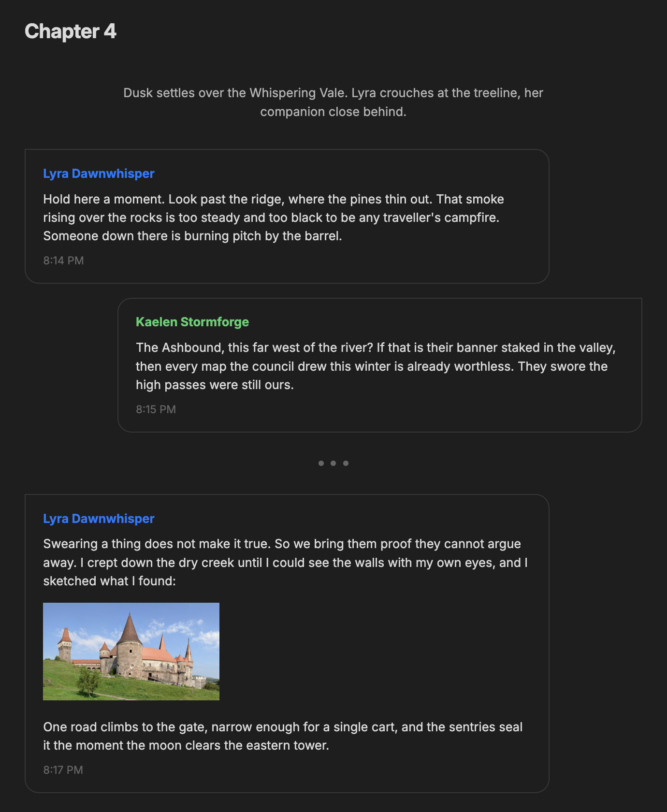
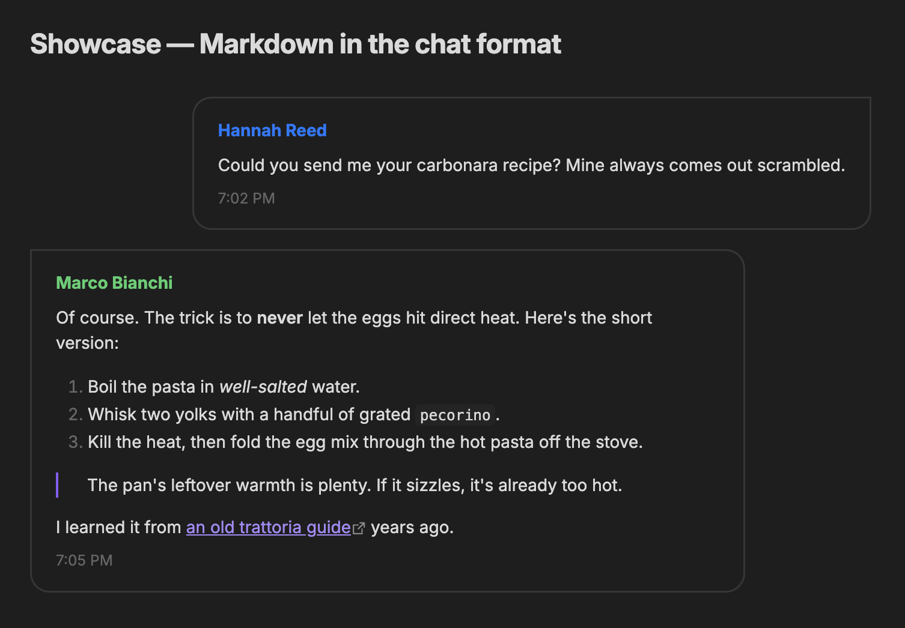
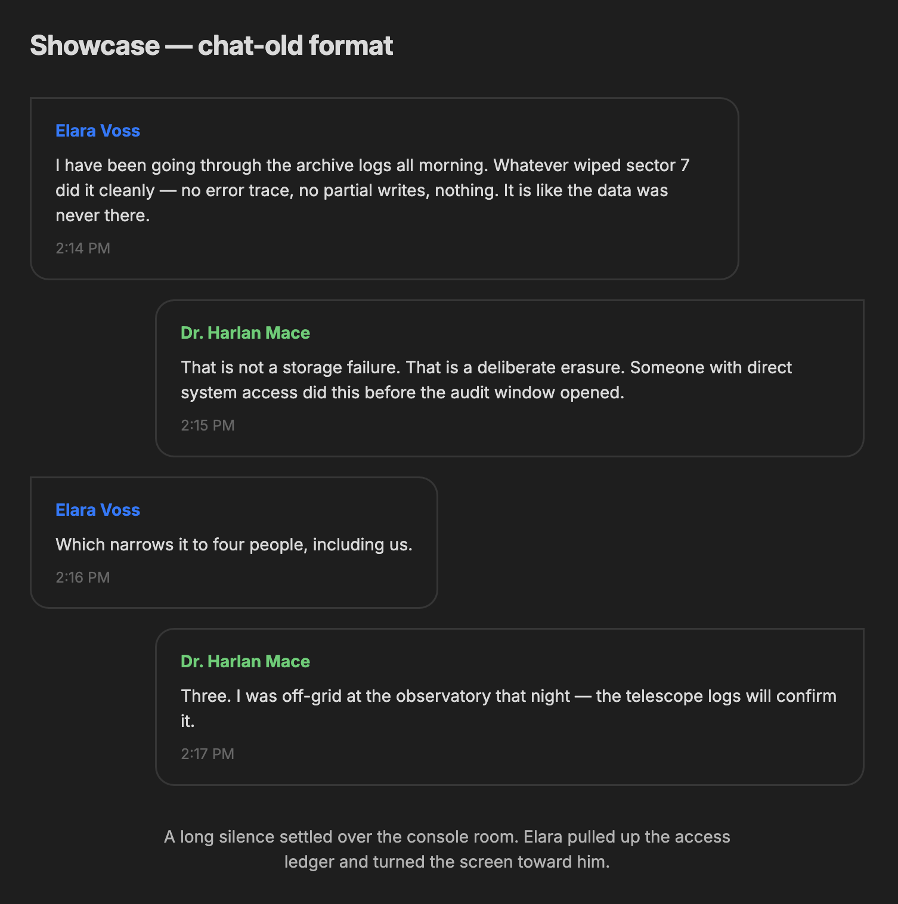
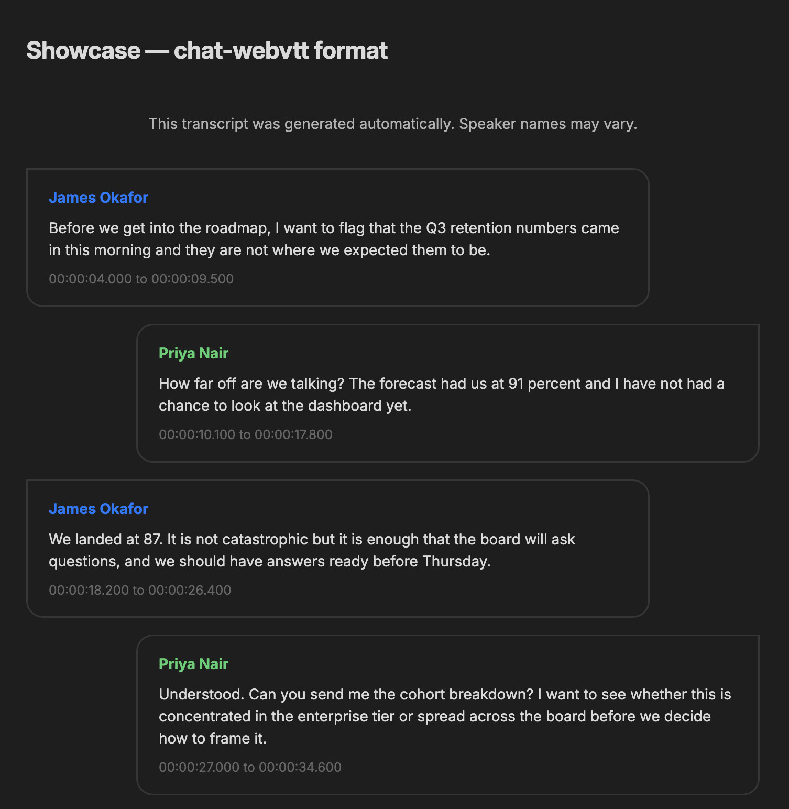
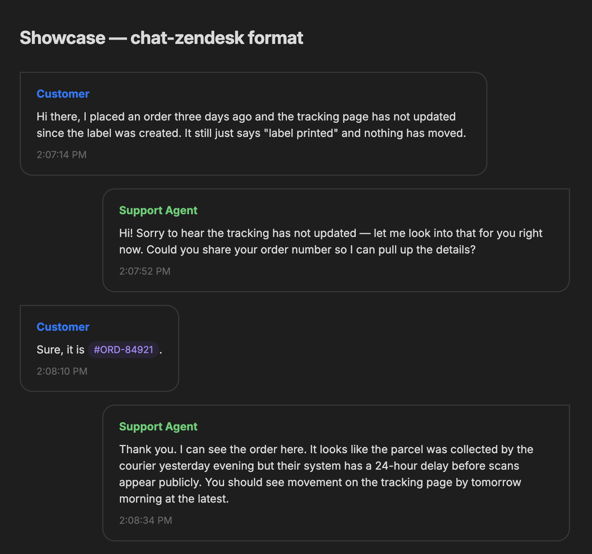
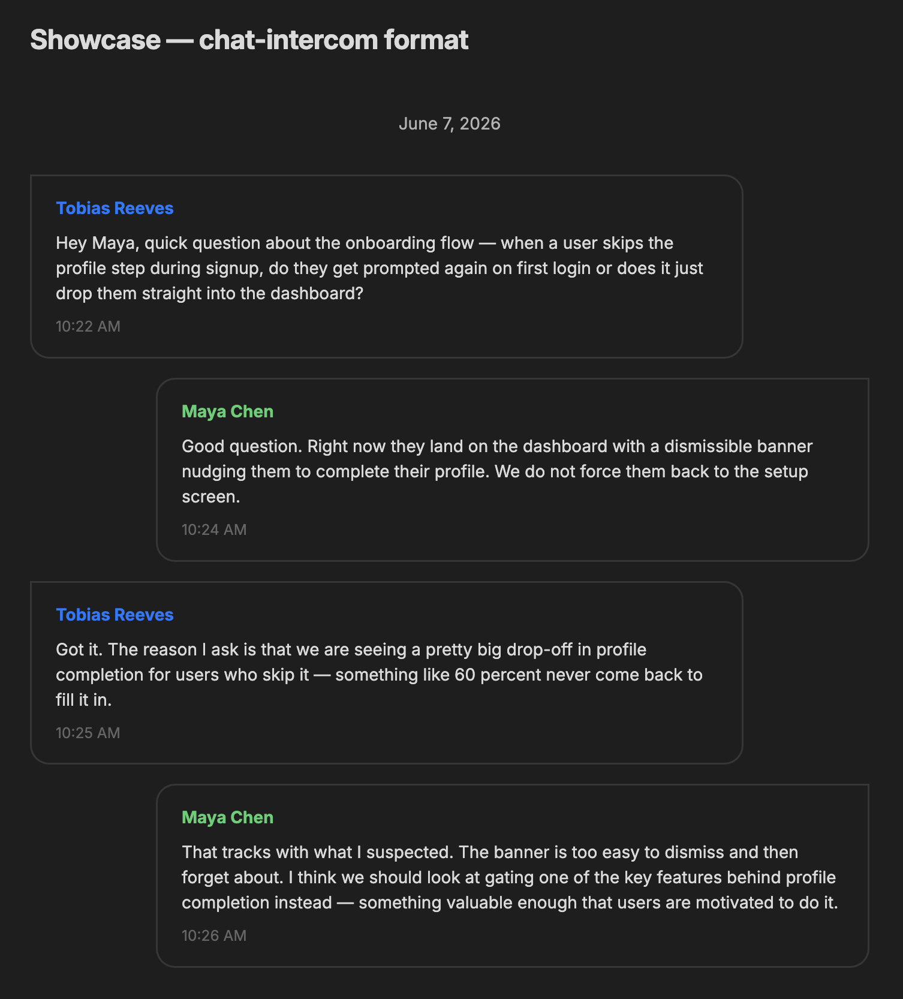

# Obsidian Chat View Plugin
Chat View lets you quickly and easily create elegant Chat UIs in your Markdown Files.



Version 2.0 is a full rewrite. The default `chat` format is new, and it understands multi-line messages, embedded images, automatic speaker colors and a cleaner way of aligning your bubbles. If you've been using the plugin since 1.x and want your old code blocks to keep working exactly as they did, don't worry. The classic syntax lives on as the `chat-old` format. More on that further down.

On top of the two `chat` formats, the plugin can also render transcripts you've exported from elsewhere: WebVTT captions, Zendesk chats and Intercom conversations all have their own dedicated formats.

## The `chat` Format
This is the default format and the one you'll reach for most of the time. Give your code block the name `chat` and write your messages like this:

```
{{header|body|subtext}}
```

Every message has three parts separated by the `'|'` character: the **header** (usually the speaker's name), the **body** (the message itself) and the **subtext** (usually a timestamp). Any of the three can be left empty. Take a look at the example below to see how it works:
~~~
```chat
{{Elizabeth Bennett|I'm afraid I don't quite understand where you're going with this, Mr. Darcy.|5:42 PM}}
{{Fitzwilliam Darcy|I came here to tell you that I am, most ardently, in love with you.|5:43 PM}}
```
~~~

### Aligning Your Bubbles
By default every bubble sits on the left. To move a speaker over to the right, add a line starting with `'>'` followed by their name. To center a speaker, use `'^'` instead. You can list more than one name by separating them with commas, and you can put these lines anywhere in the block:
~~~
```chat
> Fitzwilliam Darcy
^ The Narrator

{{Elizabeth Bennett|This is on the left, since left is the default.|}}
{{Fitzwilliam Darcy|And this one sits on the right.|}}
{{The Narrator|While this one rests in the center.|}}
```
~~~

💡 **Alignment is set per speaker, not per message. Once you've listed a name under `'>'` or `'^'`, every message from that name is aligned the same way.**

### Continuation
When the same speaker sends two messages in a row, you usually don't want their name repeated above every bubble. Leave the header empty and the message will simply continue from the one before it, inheriting its side:
~~~
```chat
> Fitzwilliam Darcy

{{Elizabeth Bennett|You can't be serious. After all we've been through?|6:01 PM}}
{{|Yes. I will marry you.|6:02 PM}}
```
~~~
Repeating the same name in the header does the same thing, so you don't have to switch to an empty header if you'd rather keep things explicit.

### Multi-line Messages & Markdown
The body isn't limited to a single line. Start writing on the line after the first `'|'`, take as many lines as you need, and close the message off with the final `'|subtext}}'` when you're done.

What makes this worth doing is that the body is rendered as full Markdown. Anything you'd write elsewhere in a note works inside a bubble, including:

- **Bold**, *italic* and `inline code`
- Bulleted and numbered lists
- [External links](https://obsidian.md) and `[[wikilinks]]`
- Embedded images, like `![[keep.jpg|200]]`, where the `|200` sets the width
- Blockquotes, callouts, headings and tables

💡 **If you used Chat View 1.x, this is a genuine change. Back then, full-line Markdown like a list or a blockquote would take over the entire message. Now that the body is properly multi-line, all of it renders the way you'd expect.**

Here's a message that leans on a handful of these at once:
~~~
```chat
> Hannah Reed

{{Hannah Reed|Could you send me your carbonara recipe? Mine always comes out scrambled.|7:02 PM}}

{{Marco Bianchi|

Of course. The trick is to **never** let the eggs hit direct heat. Here's the short version:

1. Boil the pasta in *well-salted* water.
2. Whisk two yolks with a handful of grated `pecorino`.
3. Kill the heat, then fold the egg mix through the hot pasta off the stove.

> The pan's leftover warmth is plenty. If it sizzles, it's already too hot.

I learned it from [an old trattoria guide](https://obsidian.md) years ago.

|7:05 PM}}
```
~~~

The above code will generate the following Chat View:



### Delimiters & Comments
To draw a divider between messages, put `'...'` on a line by itself. To add a comment that sits outside the bubbles (handy for narration), start a line with the `'#'` character:
~~~
```chat
{{Lyra Dawnwhisper|Hold here a moment. That smoke is too black to be a campfire.|8:14 PM}}

# The torches below begin to drift apart, just as she foretold.

...

{{Kaelen Stormforge|Then the hour is yours. Lead on.|9:03 PM}}
```
~~~

### Showing a `|` In Your Message
Since the `'|'` character separates the three parts of a message, you'll need to escape it if you want one to actually appear. Just put a backslash in front of it, like this: `\|`. This is exactly what makes the `![[keep.jpg|200]]` embed from earlier work, since that pipe needs to survive into the Markdown.

### Putting It All Together
Everything above comes together in the banner at the top of this page. Here's the code behind it:
~~~
```chat
> Kaelen Stormforge

# Dusk settles over the Whispering Vale. Lyra crouches at the treeline, her companion close behind.

{{Lyra Dawnwhisper|Hold here a moment. Look past the ridge, where the pines thin out. That smoke rising over the rocks is too steady and too black to be any traveller's campfire. Someone down there is burning pitch by the barrel.|8:14 PM}}

{{Kaelen Stormforge|The Ashbound, this far west of the river? If that is their banner staked in the valley, then every map the council drew this winter is already worthless. They swore the high passes were still ours.|8:15 PM}}

...

{{Lyra Dawnwhisper|

Swearing a thing does not make it true. So we bring them proof they cannot argue away. I crept down the dry creek until I could see the walls with my own eyes, and I sketched what I found:

![[keep.jpg|200]]

One road climbs to the gate, narrow enough for a single cart, and the sentries seal it the moment the moon clears the eastern tower.

|8:17 PM}}

...

{{Kaelen Stormforge|A bold plan, scout, and a thin one. That road would pen us in like sheep if the gap shut early. Tell me you have a second way down off that rock before I agree to anything.|8:18 PM}}

{{Lyra Dawnwhisper|If the front gate closes, we go over the cistern wall on the north face. They leave it unguarded because they believe it cannot be climbed. They have simply never watched me climb.|8:19 PM}}

...

# The torches below begin to drift apart, just as she foretold.

{{Kaelen Stormforge|Then the hour is yours. Lead on, and I will be the shadow at your back. Whatever waits behind those walls, we walk out together or we do not walk out at all.|9:03 PM}}
```
~~~

## The `chat-old` Format
If you've been using Chat View since the 1.x days, this is the format you already know. Give your code block the name `chat-old` and your existing blocks will render just like they always have.

Every message is a single line that starts with `'<'`, `'>'` or `'^'` to align it left, right or center. After the marker come the same three parts as before, separated by `'|'`: the header, the message and the subtext. You can leave parts out, and a line on its own with no `'|'` is treated as just a message. Delimiters (`'...'`) and comments (`'#'`) work here too. Take a look:
~~~
```chat-old
< Elara Voss | I have been going through the archive logs all morning. Whatever wiped sector 7 did it cleanly. It is like the data was never there. | 2:14 PM
> Dr. Harlan Mace | That is not a storage failure. That is a deliberate erasure. | 2:15 PM
< Elara Voss | Which narrows it to four people, including us. | 2:16 PM
> Dr. Harlan Mace | Three. I was off-grid at the observatory that night. | 2:17 PM
# A long silence settled over the console room. Elara turned the screen toward him.
< Elara Voss | Then you had better hope those logs are intact, because your clearance badge was used at 1:52 AM. | 2:19 PM
...
> Dr. Harlan Mace | That is not possible. Show me the exact entry. | 2:21 PM
```
~~~

The above code will generate the following Chat View:



## WebVTT Support!
Chat View can render WebVTT caption files, which is the format most meeting tools and video players export their transcripts in. Give your code block the name `chat-webvtt` and paste your WebVTT in. There are a few things worth knowing:

1. Make sure your code starts with `WEBVTT` on the very first line. That's how the format identifies itself.
2. You can align speakers to the right by adding a `Self:` line in the metadata, right after `WEBVTT` with no blank line in between. List one or more names separated by commas, and every cue from those speakers will sit on the right.
3. The plugin reads speaker names from voice tags (`<v Speaker Name>...</v>`). A cue without a voice tag still renders, just without a name on it.
4. `NOTE` blocks become comments, and each cue's timestamp range shows up as its subtext.

Here's an example:
~~~
```chat-webvtt
WEBVTT
Self: Priya Nair

NOTE This transcript was generated automatically. Speaker names may vary.

00:00:04.000 --> 00:00:09.500
<v James Okafor>Before we get into the roadmap, I want to flag that the Q3 retention numbers came in this morning and they are not where we expected them to be.</v>

00:00:10.100 --> 00:00:17.800
<v Priya Nair>How far off are we talking? The forecast had us at 91 percent and I have not had a chance to look at the dashboard yet.</v>

00:00:18.200 --> 00:00:26.400
<v James Okafor>We landed at 87. It is not catastrophic but it is enough that the board will ask questions, and we should have answers ready before Thursday.</v>

00:00:27.000 --> 00:00:34.600
<v Priya Nair>Understood. Can you send me the cohort breakdown? I want to see whether this is concentrated in the enterprise tier or spread across the board.</v>

00:00:35.200 --> 00:00:40.100
<v James Okafor>Sending it now. Loop in Sadie from data, she already has the churn attribution model running.</v>
```
~~~

The above code will generate the following Chat View:



## Zendesk & Customer Support Transcripts
If you export chat transcripts from Zendesk or a similar support tool, the `chat-zendesk` format will render them for you. Each message looks like `[timestamp] Speaker: message`, and both square `[]` and round `()` brackets are accepted around the timestamp. A few notes:

1. Add a `'>'` line at the top listing the names you'd like aligned on the right, just like in the `chat` format.
2. Wrap a line in three stars, like `*** Customer has left the chat ***`, to turn it into a comment.
3. Any line that doesn't match the transcript format is treated as a comment too, so stray system messages won't break your view.

Here's an example:
~~~
```chat-zendesk
> Support Agent

(2:07:14 PM) Customer: Hi there, I placed an order three days ago and the tracking page has not updated since the label was created. It still just says "label printed".
(2:07:52 PM) Support Agent: Hi! Sorry to hear that. Let me look into it right now. Could you share your order number so I can pull up the details?
(2:08:10 PM) Customer: Sure, it is #ORD-84921.
(2:08:34 PM) Support Agent: Thank you. I can see it here. The parcel was collected by the courier yesterday evening, but their system has a 24-hour delay before scans appear publicly. You should see movement by tomorrow morning.
(2:09:01 PM) Customer: Oh that is a relief, I was worried it had been lost.
(2:09:28 PM) Support Agent: If the tracking still shows nothing by 3 PM tomorrow, just reply here and we will raise a formal trace with the courier on your behalf.
*** Customer has left the chat ***
```
~~~

The above code will generate the following Chat View:



## Intercom Conversations
The `chat-intercom` format renders conversations in the style Intercom exports them. Each message starts with a clock timestamp, then a `'|'`, then the speaker and their message: `HH:MM AM/PM | Speaker: message`. The format has a couple of nice touches:

1. Add a `'>'` line listing the names you'd like on the right, same as the other formats.
2. A message can run across several lines. Just keep writing on the lines below it (indented or blank-separated) and they'll be folded into the same bubble.
3. A line wrapped in dashes, like `--- June 7, 2026 ---`, becomes a comment, which is perfect for date separators. A line that's just `---` on its own becomes a delimiter.

Here's an example:
~~~
```chat-intercom
> Maya Chen

--- June 7, 2026 ---
10:22 AM | Tobias Reeves: Hey Maya, quick question about the onboarding flow. When a user skips the profile step during signup, do they get prompted again on first login or does it drop them straight into the dashboard?
10:24 AM | Maya Chen: Good question. Right now they land on the dashboard with a dismissible banner nudging them to complete their profile. We do not force them back to the setup screen.
10:25 AM | Tobias Reeves: Got it. The reason I ask is that we are seeing a big drop-off in profile completion for users who skip it. Something like 60 percent never come back to fill it in.
10:26 AM | Maya Chen: That tracks with what I suspected. The banner is too easy to dismiss and forget. I think we should gate one of the key features behind profile completion instead.
10:27 AM | Tobias Reeves: That makes sense. Which feature were you thinking? It would need to be something they hit early in the session.
10:28 AM | Maya Chen: Probably the team invite flow. You cannot meaningfully use the product alone, so requiring a complete profile before inviting colleagues feels motivated rather than arbitrary.
```
~~~

The above code will generate the following Chat View:



## Upgrading from 1.x
A few things have changed since the 1.x releases, so here's a quick rundown if you're coming from an older version:

- **The default `chat` format is new.** It now uses the `{{header|body|subtext}}` syntax described above. If you'd like your old blocks to keep rendering as they always did, rename them to `chat-old`.
- **Header colors are automatic now.** Each speaker is assigned a color the first time they appear, so there's no need to set them by hand.
- **The old `chat-transcript` format is now `chat-zendesk`.** Rename your blocks and they'll render the same way.
- **The per-block styling options from 1.x are not part of this release.** Header size, max width, minimal mode and manual color config have been set aside while the formats themselves were rebuilt.

## Thank you for reading!

This project is published under the [MIT License](LICENSE).
